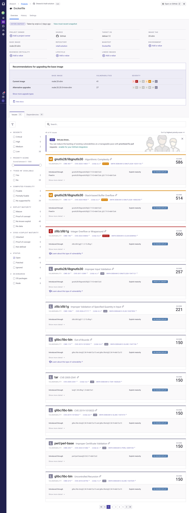
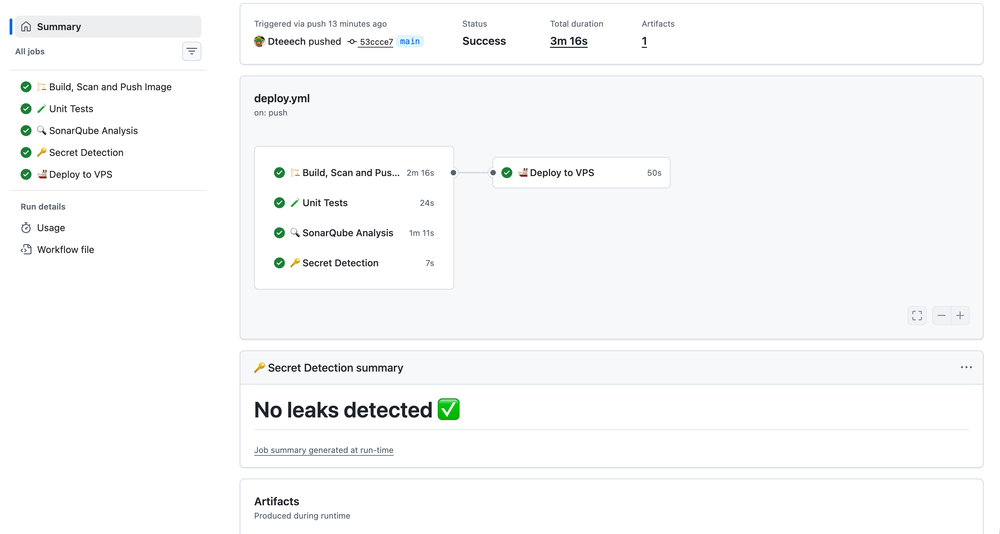
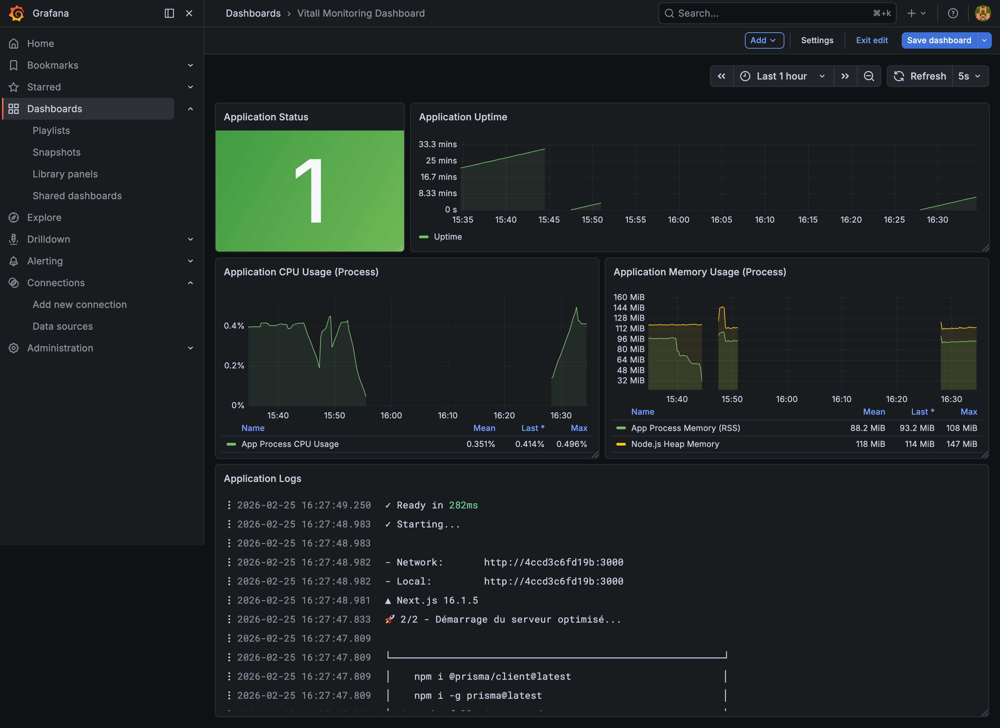
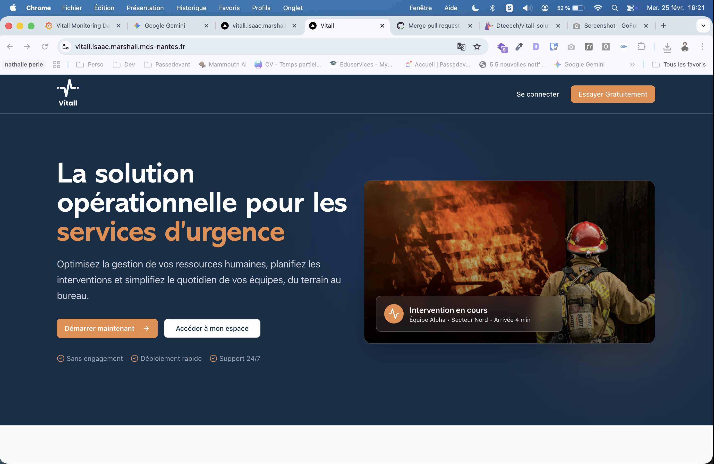

# Architecture du Projet Vitall

> **Plateforme modulaire pour les services institutionnels**

---

## � Sommaire

1. [🚀 Documentation technique (Lancer le projet)](#-documentation-technique-lancer-le-projet)
2. [🏗️ Architecture & Démarche DevSecOps](#️-architecture--démarche-devsecops)
3. [🚢 Déploiement & Maintenance](#-déploiement--maintenance)

---

## �🚀 Documentation technique (Lancer le projet)

### Installation Locale (sans Docker)

1. **Cloner le dépôt** : `git clone <url-du-repo> && cd vitall-solution`
2. **Variables d'environnement** : `cp .env.example .env`
3. **Dépendances** : `npm install`
4. **Base de données** :
   ```bash
   npx prisma generate
   npx prisma db push
   npx tsx prisma/seed.ts
   ```
5. **Démarrer** : `npm run dev`

### Installation via Docker

```bash
docker compose up -d
```

---

## 🏗️ Architecture & Démarche DevSecOps

### Philosophie du Projet

Notre approche repose sur la philosophie **DevSecOps** : la sécurité n'est pas une étape finale mais une composante continue du cycle de développement ("Shift-Left Security"). Chaque modification de code est automatiquement validée sous l'angle de la qualité, de la sécurité et de la résilience.

### Pourquoi ces outils ?



*   **Snyk & Alpine Linux** : Nous avons identifié que les images standard (Debian/Ubuntu) embarquent souvent des centaines de vulnérabilités connues (CVE). En passant à **Alpine Linux**, nous avons réduit ce nombre à **zéro** pour l'image de base. Snyk agit comme une barrière bloquante en CI si une nouvelle vulnérabilité critique est introduite via une dépendance npm.
*   **Gitleaks** : La fuite de secrets (clés Stripe, tokens GH) est le premier vecteur d'attaque. Gitleaks scanne l'historique complet pour empêcher tout commit contenant un secret en clair.
*   **GitHub Actions** : Pour l'automatisation totale ("Security as Code"). Le pipeline ne se contente pas de builder l'image, il audite chaque brique avant de pousser en production.

### Défis rencontrés & Solutions

*   **Problème** : Taille des images Docker et lenteur des pipelines.
*   **Solution** : Utilisation du **Multi-stage Build**. On ne garde que le binaire compilé de Next.js (`standalone`) et on supprime `npm` de l'image de production (éliminant ainsi les vulnérabilités liées au gestionnaire de paquets).
*   **Problème** : Dépendance au réseau lors du déploiement.
*   **Solution** : Utilisation d'un registre d'images (GHCR) privé et sécurisé permettant des rollbacks instantanés.

---

## 🚢 Déploiement & Maintenance

### Pipeline Pipeline CI/CD



Chaque push sur `main` déclenche un audit complet :
1.  **Audits de code** (Tests unitaires & SonarQube).
2.  **Scan de vulnérabilités** conteneur avec Snyk.
3.  **Détection de secrets** avec Gitleaks.
4.  **Déploiement atomique** sur le VPS si 100% des tests sont verts.

### Monitoring & Observabilité



L'état de santé est surveillé via la stack **Prometheus / Grafana / Loki** :
- **Dashboard en direct** : Visualisation du CPU, RAM, et taux de requêtes HTTP.
- **Loki** : Centralisation des logs applicatifs pour un debugging rapide en cas d'incident.

### Accès sécurisé (Checklist)



- [x] **HTTPS/SSL** : Chiffrement intégral des échanges.
- [x] **Rollback Procédure** : Commande prête pour retour arrière en < 30s.
- [x] **Secret Management** : Variables d'environnement injectées dynamiquement.

### 🔄 Procédure de Rollback

Si la production échoue :
1. **Via GitHub Actions** : Ré-exécuter le dernier job réussi.
2. **Manuellement** :
   ```bash
   docker compose pull
   docker compose up -d --force-recreate
   ```
3. **Retour BDD** : `docker compose exec -T postgres psql -U vitall_user vitall_db < backup_prev.sql`

---
*M2 Chef de Projet Digital — Option Fullstack — 2025/2026*
